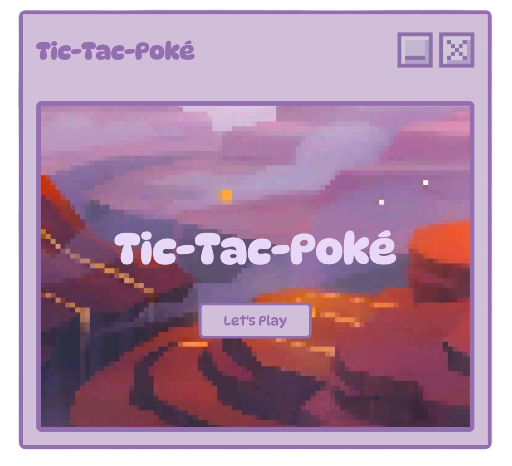
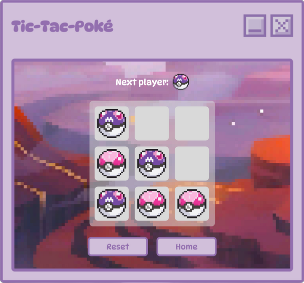

# 🎮 Tic-Tac-Poké

Tic-Tac-Poké is a **fun and cute version** on the classic Tic-Tac-Toe game — now starring the **Master Ball** and **Love Ball** from the world of Pokémon! The game lets you play against a friend within a cute Pokémon-themed environment.

Built using:

- ⚛️ React – for a dynamic, interactive game UI
- ⚡ Vite – for fast hot-reloading during development
- 🖥️ Electron – to turn the web experience into a cozy desktop app

---

## 🌟 Features

- 🟣 Play as either the **Master Ball** or 💗 the **Love Ball**
- 🎨 Pokémon-inspired visuals and retro charm
- ✨ Smooth, responsive gameplay using React 
- 🖥️ Cross-platform desktop support via Electron
- 🎉 Winner detection + draw screen animations
- 🔁 Restart and play again endlessly!

---

## 🖼️ Preview

Here's a peek at the game:

<div style="display: flex; gap: 16px; justify-content: center;">
  
  
</div>

---

## 🛠️ Tech Stack

| Tool       | Purpose                              |
|------------|--------------------------------------|
| React      | Build the game UI and logic          |
| Vite       | Dev server, bundling, and HMR        |
| Electron   | Wrap the app into a native desktop app |
| npm        | Dependency management and scripts    |

---

## 🚀 Getting Started

### **Prerequisities**

- **Node.js** (preferably the latest LTS version)
- **npm**
- For cross-platform builds, you'll need to have the appropriate environment set up for either macOS or windows.

### 🧑‍💻 **Installation**

1. **Clone the repository**

    ```bash
    git clone https://github.com/kellytton/tic-tac-poke.git
    cd tic-tac-poke
    ```

2. **Install Dependencies**

    ```bash
    npm install
    ```
    This will create the `node_modules` folder and install all the necessary dependencies.

### 🛠️️ **Building for Your Platform**

1. **macOS**
    ```bash
    npm run app:build
    ```
    This will create a `.dmg` file that you can install and run on macOS.

2. **Windows**

    ```bash
    npm run app:build
    ```
    This will create a `.exe` file that you can install and run on Windows.
